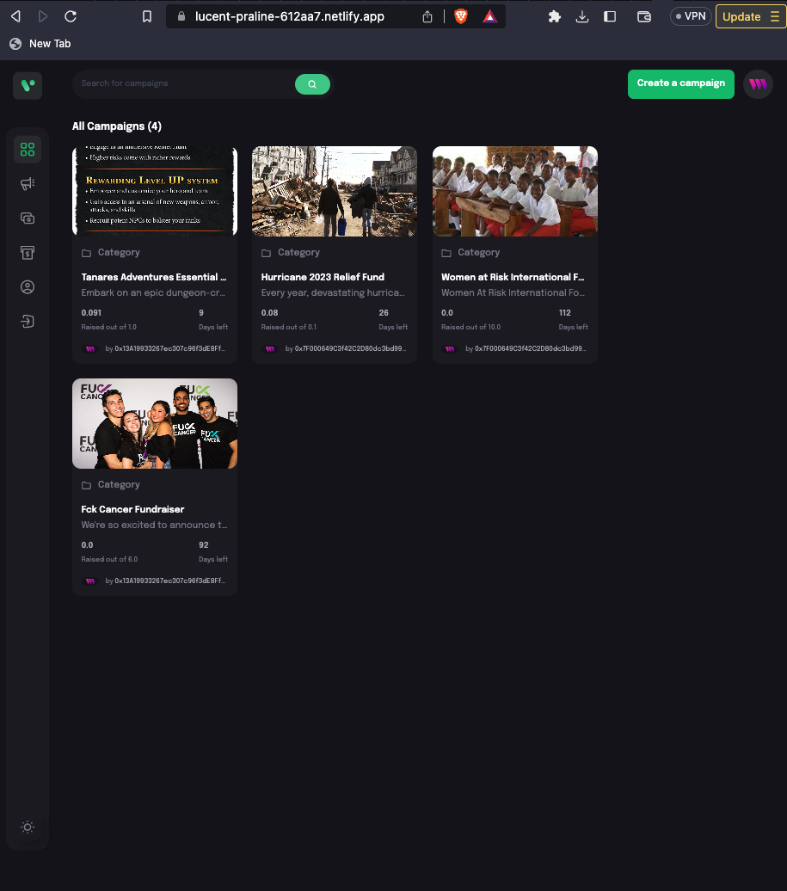

# Blockchain-based crowdfunding platform

This Decentralized application (DAPP) demonstrates an application for people to get donations for their projects or humanity use cases.

Back-end parts (solidity) are located in web3 folder. Front-end parts are located in client folder.

We will be using Using **Thirdweb** and **Hardhat** to create and deploy the dApp on Sepolia testnet. Thirdweb is a tool for creating, deploying, and managing dApps on the Ethereum blockchain and hardhat is a development environment for Ethereum smart contract development.

## System architecture

System include services (with folders):

- **client** (front-end): we use Vite.
- **web3**: stored smart contracts and compile+deploy to Ethereum.

For steps on how to create a new contract using Thirdweb, see `web3/README.md`

For steps on how to create the client-side, see `client/README.md`

### Edit some env variable to run correctly

First, in file `web3/.env`:

--> In this project, I choose alchemy to sync states on blockchain. The `envExample` file guides you on what is required.

## How to use?

To use this dApp, use must have an extension called `Metamask`, this is web browser extension, you can install it on Firefox, Chrome, Opera, etc.

## Additional Functionality

- Delete a campaign
- Updating campaigns
- Adding a platform fee
- Cannot donate 0 or less
- Cannot donate after deadline
